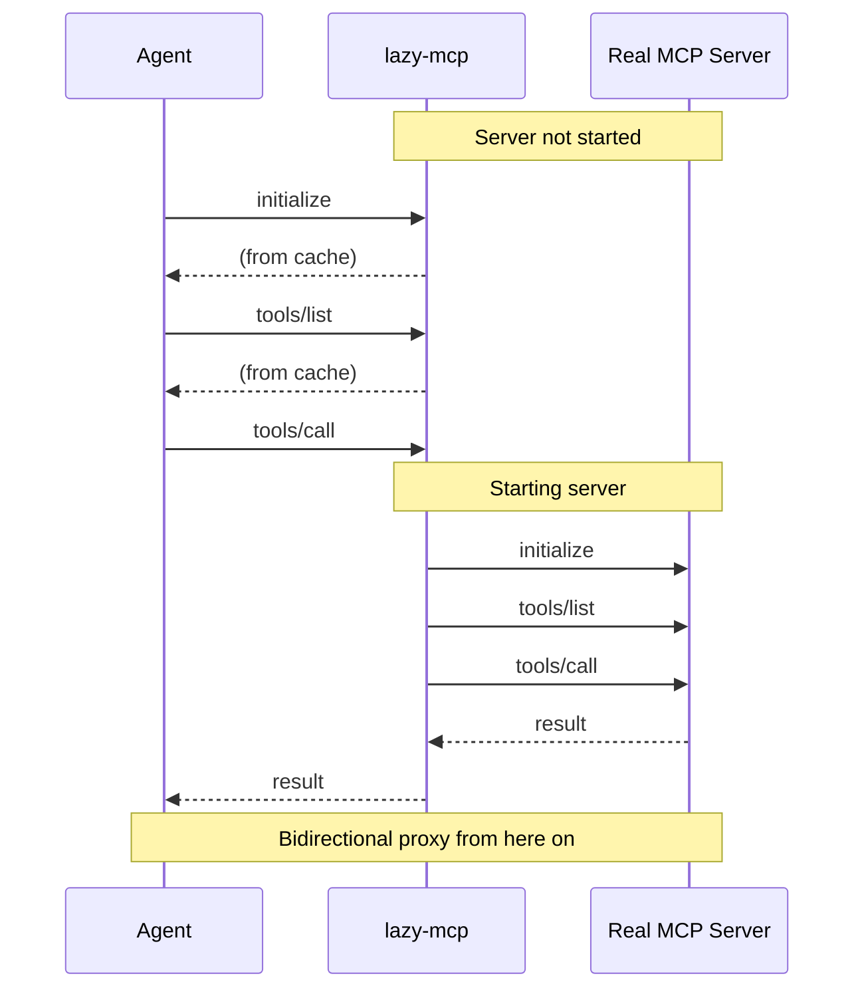

# lazy-mcp

[](https://github.com/tkukushkin/lazy-mcp/actions/workflows/test.yml)
[](https://codecov.io/gh/tkukushkin/lazy-mcp)

A lazy proxy for [MCP](https://modelcontextprotocol.io/) (Model Context Protocol) servers over stdio. It defers starting the real server until a tool is actually called, serving discovery responses from a local cache in the meantime.

## Why

When an agent connects to an MCP server, it immediately starts the server process and queries its capabilities (`initialize`, `tools/list`, `resources/list`, `prompts/list`). This happens for every configured server, even if none of their tools are ever used during the session.

For setups with many MCP servers this means:

- **Wasted resources** — every server process runs for the entire session, consuming memory and CPU, even if never used.
- **Slow startup** — the agent blocks while each server initializes. Servers that pull dependencies (e.g. `uvx`, `npx`) or connect to external services can take seconds each.
- **Unnecessary network traffic** — servers that authenticate against APIs or fetch remote schemas do so eagerly, even when not needed.

lazy-mcp solves this by caching discovery responses and only starting the real server when a non-discovery request (like `tools/call`) arrives.

## How it works



On the first run (no cache), lazy-mcp proxies transparently and builds the cache. On subsequent runs, discovery responses are served instantly from cache — the real server is never started unless a tool is actually called.

## Installation

Download a prebuilt binary (auto-detects OS and architecture):

```bash
curl -fsSL https://raw.githubusercontent.com/tkukushkin/lazy-mcp/master/install.sh | sh
```

### Install with Go

```bash
go install github.com/tkukushkin/lazy-mcp@latest
```

Or run without installing:

```bash
go run github.com/tkukushkin/lazy-mcp@latest -- uvx some-mcp-server
```

### Build from source

```bash
git clone https://github.com/tkukushkin/lazy-mcp.git
cd lazy-mcp
go build -o lazy-mcp .
```

## Usage

Wrap any MCP server command with `lazy-mcp --`:

```jsonc
// Claude Code config (~/.claude/claude_desktop_config.json)
{
  "mcpServers": {
    "some-server": {
      "command": "lazy-mcp",
      "args": ["--", "uvx", "some-mcp-server", "--arg1", "--arg2"]
    }
  }
}
```

Instead of:

```jsonc
{
  "mcpServers": {
    "some-server": {
      "command": "uvx",
      "args": ["some-mcp-server", "--arg1", "--arg2"]
    }
  }
}
```

## Cache

Discovery responses are cached in the OS cache directory:

| OS    | Path                                      |
|-------|-------------------------------------------|
| macOS | `~/Library/Caches/lazy-mcp/`              |
| Linux | `~/.cache/lazy-mcp/`                      |

Each MCP server command gets its own cache file, keyed by a SHA-256 hash of the full command and arguments.

To clear the cache for all servers:

```bash
lazy-mcp clear-cache
```

The cache is updated every time the real server is started, so it stays fresh automatically.

### Override cache directory

Set `LAZY_MCP_CACHE_DIR` to use a custom cache location:

```bash
LAZY_MCP_CACHE_DIR=/tmp/mcp-cache lazy-mcp -- uvx some-server
```

## Zero dependencies

lazy-mcp is a single static binary with no external dependencies. It uses only the Go standard library.

## License

MIT
